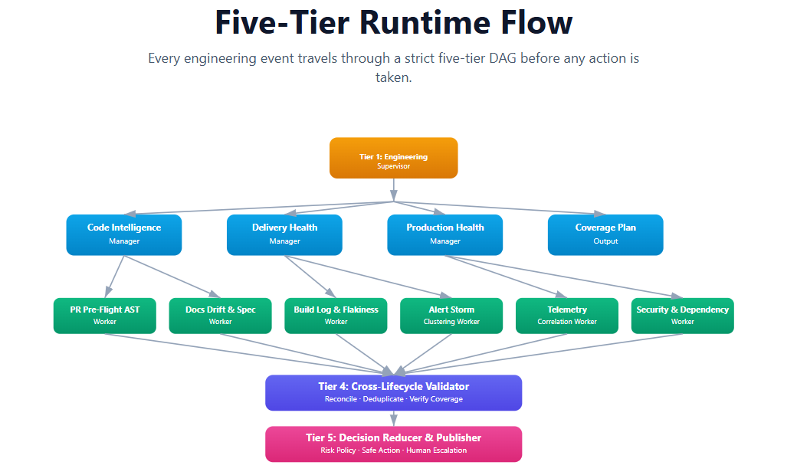

# ForgeMind — Hierarchical Engineering Agent System

> **An autonomous engineering control plane that correlates signals across the software lifecycle — and knows when to act versus when to ask a human.**


## What ForgeMind Is

- **5-Tier Hierarchical DAG** — strict separation of supervision, domain management, specialist investigation, evidence validation, and decision reduction.
- **Evidence-Driven** — leaf workers emit structured, verifiable `EvidenceShard`s; cross-domain reconciliation occurs strictly before decisions.
- **Fortified Enterprise Fleet** — built on Google ADK 2, Vertex AI Gemini, with scoped authority, provable evidence, and human escalation.

## The Five Tiers

```
Event Sources → Acquire Layer (Event Gateway)
    → Tier 1: Engineering Supervisor        (CoveragePlan)
    → Tier 2: Domain Managers ×3            (DomainFinding)
    → Tier 3: Specialist Workers ×6         (EvidenceShard)
    → Tier 4: Cross-Lifecycle Validator     (ValidatedSituation)
    → Tier 5: Decision Reducer & Publisher  (DecisionRecord · ProposedAction · Escalation)
```

**Canonical runtime chain:** `Acquire → Analyze → Reconcile → Produce → Validate`



## Features

| Feature | Description |
|---------|-------------|
| **Evidence-derived confidence** | Different PRs score differently based on actual file content |
| **File-derived domains** | CI files → delivery, auth files → production (ADR-014) |
| **Honest UNAVAILABLE** | System admits when it can't assess production signals (ADR-013) |
| **Full provenance** | Every artifact traces back to the source event |
| **No-bypass gate** | Action validation is the only publish point |
| **ADK Runner mode** | Google ADK 2.0 agents call tools that execute the tiers |
| **Human approval gate** | High-risk actions require human authority |

## Quick Start

```bash
# Requires Python >= 3.11 and uv
uv sync                      # install dependencies (incl. dev group)
uv run pytest tests/         # run the test suite (298 passed, 1 skipped)

# Validate a fixture end-to-end
PYTHONPATH=src python scripts/run_fixture.py fixtures/inputs/FIXTURE-001-happy-path.json

# Run the API locally
PYTHONPATH=src uvicorn forgemind.api:create_api --factory --reload
# open http://127.0.0.1:8000/  -> M3 judge-visible surface
```

Full spin-up, AI-enablement, and Cloud Run deploy guide: [`SUBMISSION/SPINUP.md`](SUBMISSION/SPINUP.md)

## Live App

**URL:** https://forgemind-n3nupsii5a-uc.a.run.app

**Always-on endpoints:**
- **Judge dashboard:** https://forgemind-n3nupsii5a-uc.a.run.app/ — provenance, validation, uncertainty, and human control
- **Health check:** https://forgemind-n3nupsii5a-uc.a.run.app/api/v1/health → `{"status":"ok","phases_complete":6}`
- **Registered ADK agents:** https://forgemind-n3nupsii5a-uc.a.run.app/api/v1/adk/agents → 6 agents

**PR analysis dashboards** (populated by real GitHub webhook events):
- PR #210 (CI + Docs + Scripts): https://forgemind-n3nupsii5a-uc.a.run.app/view/SIT-GITHUB-210
- PR #204 (Dependabot CI only): https://forgemind-n3nupsii5a-uc.a.run.app/view/SIT-GITHUB-204

> **Note:** the Cloud Run situation store is ephemeral (scale-to-zero). If a PR dashboard is empty after a cold start, re-trigger it with the manual webhook test in the section below — the situation is rebuilt from the real PR payload.

## GitHub Webhook Setup

ForgeMind analyzes PRs automatically via GitHub webhook.

### Quick setup:
1. Go to your GitHub repository → Settings → Webhooks → Add webhook
2. Payload URL: `https://forgemind-n3nupsii5a-uc.a.run.app/api/v1/adk/webhook`
3. Content type: `application/json`
4. Events: Select "Pull requests"
5. Active: ✓

Every PR opened will trigger ForgeMind's analysis and post a structured comment.

### Manual test:
```bash
curl -X POST "https://forgemind-n3nupsii5a-uc.a.run.app/api/v1/adk/webhook" \
  -H 'Content-Type: application/json' \
  -d '{
    "action": "opened",
    "number": 210,
    "pull_request": {
      "number": 210,
      "title": "Your PR title",
      "created_at": "2026-08-30T10:00:00Z",
      "head": {"sha": "abc123..."},
      "html_url": "https://github.com/your-org/your-repo/pull/210",
      "state": "open"
    },
    "repository": {"full_name": "your-org/your-repo"},
    "sender": {"login": "your-username"}
  }'
```

## Repository Layout

| Path | Purpose |
|------|---------|
| [`src/forgemind/`](src/forgemind/) | Importable package (tier implementations) |
| [`specs/001-hierarchical-runtime-dag/`](specs/001-hierarchical-runtime-dag/) | Canonical spec: `spec.md`, `plan.md`, `tasks.md`, 9 JSON Schema contracts |
| [`fixtures/`](fixtures/) | Phase 0 fixtures + expected assertions |
| [`scripts/`](scripts/) | Fixture runner, boundary enforcement, knowledge-brain sync |
| [`tests/`](tests/) | Contract + integration suites |
| [`docs/`](docs/) | Project vision, architecture, current state, decisions (ADRs), failure log |
| [`SUBMISSION/`](SUBMISSION/) | Hackathon artifacts: `ARCHITECTURE.md`, `SPINUP.md`, `PROJECT_STORY.md`, `DEMO_SCRIPT.md`, `WRITEUP.md`, `CHECKLIST.md` |

## Documentation

- [`docs/PROJECT.md`](docs/PROJECT.md) — North-star vision, core problem, design principles
- [`docs/ARCHITECTURE.md`](docs/ARCHITECTURE.md) — Five-tier DAG, artifact lineage, infrastructure mapping
- [`docs/CURRENT_STATE.md`](docs/CURRENT_STATE.md) — Verified project status (start here)
- [`specs/001-hierarchical-runtime-dag/spec.md`](specs/001-hierarchical-runtime-dag/spec.md) — Canonical executable specification
- [`docs/decisions/`](docs/decisions/) — Architecture Decision Records (14 ADRs)
- [`SUBMISSION/`](SUBMISSION/) — Hackathon artifacts

## Technology Baseline

| Component | Technology | Status |
|-----------|------------|--------|
| **Reasoning Engine** | Gemini 3.5 via Vertex AI | ✅ ADR-010 |
| **Workflow Runtime** | Google ADK 2 | ✅ ADR-008 |
| **Deployment** | Google Cloud Run | ✅ M2 |
| **Contracts** | JSON Schema draft-07 | ✅ 9 canonical artifacts |
| **Toolchain** | Python ≥ 3.11, pytest, uv, ggshield | ✅ |

## Hackathon Track

**The Fortified Enterprise Fleet** — enterprise agents with scoped authority, provable evidence, and hard boundaries that keep humans in control.

### Requirements Coverage

| Requirement | Status |
|-------------|--------|
| **Gemini 3.5+** | ✅ Gemini 3.5 Flash via Vertex AI (`google-genai`) |
| **Google Agent Framework** | ✅ Google ADK 2.0 |
| **Google Cloud Service** | ✅ Cloud Run |

## License

[MIT](LICENSE)
