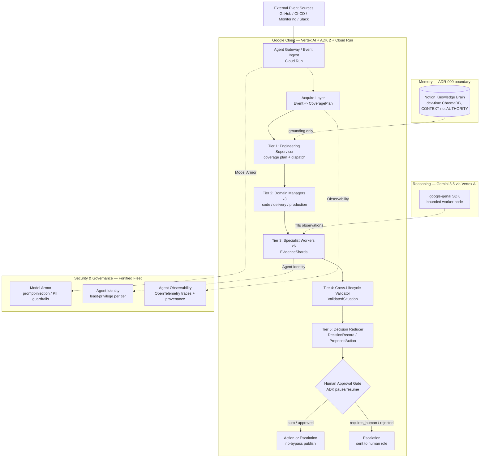

# ForgeMind v3.0 — Architecture Diagram (All Things Agentic Hackathon)

**Track:** The Fortified Enterprise Fleet
**Deadline:** 2026-08-31 · **Status:** M1 local + M2 Cloud Run + M3 judge surface COMPLETE

## System Diagram (Mermaid)



## Hackathon mandatory requirements — coverage map

| Requirement | How ForgeMind satisfies it |
|---|---|
| **Gemini 3.5+ via Gemini API or Vertex AI** | `src/forgemind/llm/adapter.py` calls Gemini 3.5 Flash via `google-genai` (Vertex AI). Fail-closed to deterministic if no creds. |
| **≥1 Google Agent Framework (ADK / GenAI SDK / Antigravity / GenKit)** | **Both** Google ADK 2 (`adk_runtime.py` workflow graph) **and** GenAI SDK (`google-genai`) are used. |
| **≥1 GCP infrastructure service** | **Cloud Run** (M2 deployed `forgemind-v3-prod`, us-central1). |

## Fortified Enterprise Fleet capability map

| Fleet capability | ForgeMind realization |
|---|---|
| Agent Registry | Canonical spec + contracts under `specs/001-hierarchical-runtime-dag/`; tiers are versioned, bounded roles. |
| Agent Runtime | `adk_runtime.py` — long-running, pause/resume-capable workflow over the five-tier DAG. |
| Memory Bank | Notion Knowledge Brain (ADR-009) — **dev-time CONTEXT only**; runtime memory deferred to post-M3 (see Known Gaps). |
| Agent Identity | Least-privilege tier boundaries (ADR-003..007); workers have zero spawn authority. |
| Agent Gateway | `api.py` event ingest + validation; `FORGEMIND_RUNTIME` flag selects deterministic vs ADK path. |
| Model Armor | Deterministic guardrails + ActionValidation gate; Gemini confined to bounded worker node. |
| Agent Observability | `execution_trace_id` / `TRC-*` lineage + `m3_proof` provenance block on every situation. |

## Five-tier DAG (canonical lineage)

```
Event -> CoveragePlan -> EvidenceShard -> DomainFinding -> ValidatedSituation
      -> DecisionRecord -> ProposedAction -> ActionValidation -> Action | Escalation
```

Every artifact carries upstream provenance; the `GET /api/v1/situations/{id}`
and `GET /` viewer expose provenance, validation verdict, uncertainty, and
human-control state for judges.

## Known gaps (disclosed for judges)
- **Runtime Memory Bank:** ADR-009 deliberately keeps ChromaDB dev-only; the
  fleet's "persistent cross-session memory" is not in the runtime yet. Mitigated
  by durable artifact lineage + Notion grounding.
- **Model Armor** is realized via in-code deterministic guardrails + bounded
  Gemini scope, not the managed Google Cloud Model Armor service (would be a
  post-M3 hardening step).
