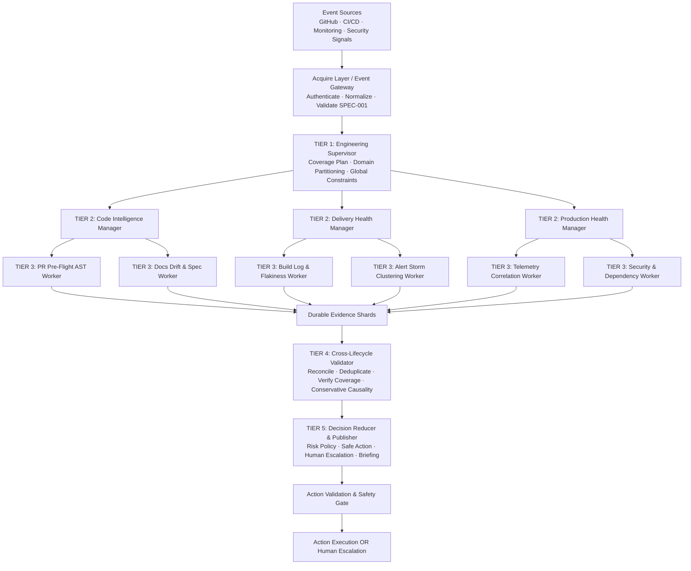

# ForgeMind Architecture (v3.0)

## System Overview

ForgeMind is an autonomous engineering control plane that follows software changes from pull request to production through a controlled **Five-Tier Directed Acyclic Graph (DAG)**:



---

## The Five Architectural Tiers

### Tier 1 — Engineering Supervisor
- **Responsibility**: Global lifecycle coordination, root trace initialization, domain partitioning, and generation of the `CoveragePlan`.
- **Boundaries**: Coordinates globally but never performs deep domain AST/log parsing. Dispatches execution plans to Domain Managers.

### Tier 2 — Domain Managers (3 Managers)
- **Managers**:
  1. **Code Intelligence Manager**: Owns PR changesets, AST impact, doc drift, and spec conformance.
  2. **Delivery Health Manager**: Owns CI/CD builds, test flakiness, deployment gates, and alert triage.
  3. **Production Health Manager**: Owns runtime telemetry, anomaly correlation, and vulnerability scans.
- **Responsibility**: Bounded domain dispatch, local retry/timeout handling, aggregating `EvidenceShard`s into `DomainFinding`s.
- **Boundaries**: Never performs cross-domain reconciliation.

### Tier 3 — Specialist Workers (6 Leaf Workers)
- **Workers**:
  1. `PR Pre-Flight AST Worker` (Code Intelligence)
  2. `Docs Drift & Spec Worker` (Code Intelligence)
  3. `Build Log & Flakiness Worker` (Delivery Health)
  4. `Alert Storm Clustering Worker` (Delivery Health)
  5. `Telemetry Correlation Worker` (Production Health)
  6. `Security & Dependency Worker` (Production Health)
- **Responsibility**: Specialized, deep evidence extraction emitting structured `EvidenceShard`s with source citations.
- **Boundaries**: Leaf nodes with **zero worker-spawning authority**. Never makes policy decisions.

### Tier 4 — Cross-Lifecycle Validator
- **Responsibility**: Multi-domain reconciliation, cross-lifecycle correlation, duplicate detection, coverage verification, and conservative causality evaluation. Emits `ValidatedSituation`.
- **Boundaries**: The *only* tier permitted to reconcile evidence across domains. Never emits autonomous actions directly.

### Tier 5 — Decision Reducer & Publisher
- **Responsibility**: Evaluates `ValidatedSituation` against enterprise autonomy and risk policy. Emits durable `DecisionRecord` and `ProposedAction`, or triggers Human Escalation.
- **Boundaries**: Separated from investigation. Consumes only validated situations.

### Downstream Pipeline — Action Validation & Safety Gate
- Evaluates `ProposedAction` against blast-radius safety rules, freshness checks, and authorization boundaries before initiating safe action execution or escalating to humans.

---

## Five-Stage Runtime Processing Chain

```plain text
Acquire → Analyze → Reconcile → Produce → Validate
```

### Canonical Artifact Lineage
```plain text
Event
  → CoveragePlan
  → EvidenceShard
  → DomainFinding
  → ValidatedSituation
  → DecisionRecord
  → ProposedAction
  → ActionValidation
  → Action OR Human Escalation
```

---

## Google Cloud & ADK 2 Infrastructure Mapping

| ForgeMind Component | Google Cloud / ADK 2 Service | Purpose |
|---|---|---|
| **Event Sources** | Cloud Pub/Sub + Cloud Run Webhooks | Normalize external webhooks (GitHub, CI/CD, Alertmanager) |
| **Event Gateway** | Agent Gateway (GEAP) on Cloud Run | Authentication, payload validation against `SPEC-001` |
| **Tier 1 (Supervisor)** | Supervisor Workflow Node (Cloud Run) | Global coverage planning, trace initialization |
| **Tier 2 (Domain Managers)** | Manager Nodes (Cloud Run) | Domain partition execution, retry management |
| **Tier 3 (Specialist Workers)** | Worker Nodes (Cloud Run) | Evidence production via Gemini 3.5 structured outputs |
| **Tier 4 (Validator)** | Validator Node (Cloud Run) | Cross-domain reconciliation, conservative causality |
| **Tier 5 (Reducer & Publisher)**| Policy Node (Cloud Run) | Risk-bound action proposal, briefing generation |
| **Workflow Runtime** | Google ADK 2 | Deterministic DAG orchestration, pause/resume human gates |
| **Reasoning Model** | Gemini 3.5 via Vertex AI | Structured reasoning and multi-modal code analysis |
| **Shared State & Memory** | Memory Bank (GEAP) + Firestore (planned) | Cross-session vector retrieval & entity knowledge |
| **Security & Guardrails** | Model Armor + Agent Identity | Input sanitization, policy guardrails, least-privilege |
| **Observability** | Agent Observability + OpenTelemetry | End-to-end trace lineage and execution audit trails |

---

## Component Boundaries in Repository

1. **`src/` (Source Code)**:
   - Modular implementation of the 5 tiers and ADK 2 workflow runner.
   - Strictly conforms to contracts in `docs/specs/SPEC-001.md`.
2. **`tests/` (Verification Suites)**:
   - Unit tests, schema validators, fixture tests (`FIXTURE-001`), and evaluation harnesses.
3. **`docs/` (Cognitive Memory)**:
   - Single source of truth for architectural records (`decisions/`), specifications (`specs/`), active status (`CURRENT_STATE.md`), and failure lessons (`FAILURE_LOG.md`).
