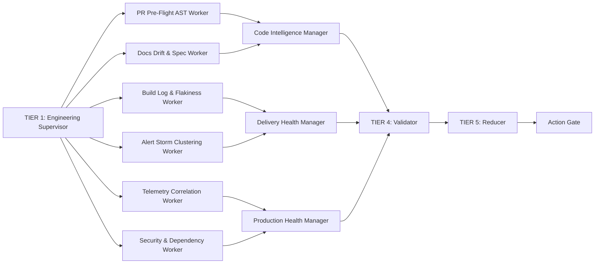
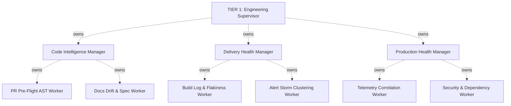

# ForgeMind Architecture (v3.0)

## System Overview

ForgeMind is an autonomous engineering control plane that follows software changes from pull request to production through a controlled **Five-Tier Directed Acyclic Graph (DAG)**:

**Execution order** (data flows left-to-right):


**Ownership** (static structure):


*Workers produce evidence shards first, then Managers aggregate findings into DomainFindings. Ownership remains hierarchical: each Manager owns 2 Workers.*

---

## The Five Architectural Tiers

### Tier 1 — Engineering Supervisor
- **Responsibility**: Global lifecycle coordination, root trace initialization, domain partitioning, and generation of the `CoveragePlan`.
- **Boundaries**: Coordinates globally but never performs deep domain AST/log parsing. Dispatches execution plans to Domain Managers.

### Tier 2 — Domain Managers (3 Managers)
- **Managers**:
  1. **Code Intelligence Manager**: Owns PR changesets, AST impact, doc drift, and spec conformance.
  2. **Delivery Health Manager**: Owns CI/CD builds, test flakiness, deployment gates, and alert triage.
  3. **Production Health Manager**: Owns runtime telemetry, anomaly correlation, and vulnerability scans.
- **Responsibility**: Bounded domain dispatch, local retry/timeout handling, aggregating `EvidenceShard`s into `DomainFinding`s.
- **Boundaries**: Never performs cross-domain reconciliation.

### Tier 3 — Specialist Workers (6 Leaf Workers)
- **Workers**:
  1. `PR Pre-Flight AST Worker` (Code Intelligence)
  2. `Docs Drift & Spec Worker` (Code Intelligence)
  3. `Build Log & Flakiness Worker` (Delivery Health)
  4. `Alert Storm Clustering Worker` (Delivery Health)
  5. `Telemetry Correlation Worker` (Production Health)
  6. `Security & Dependency Worker` (Production Health)
- **Responsibility**: Specialized, deep evidence extraction emitting structured `EvidenceShard`s with source citations.
- **Boundaries**: Leaf nodes with **zero worker-spawning authority**. Never makes policy decisions.

### Tier 4 — Cross-Lifecycle Validator
- **Responsibility**: Multi-domain reconciliation, cross-lifecycle correlation, duplicate detection, coverage verification, and conservative causality evaluation. Emits `ValidatedSituation`.
- **Boundaries**: The *only* tier permitted to reconcile evidence across domains. Never emits autonomous actions directly.

### Tier 5 — Decision Reducer & Publisher
- **Responsibility**: Evaluates `ValidatedSituation` against enterprise autonomy and risk policy. Emits durable `DecisionRecord` and `ProposedAction`, or triggers Human Escalation.
- **Boundaries**: Separated from investigation. Consumes only validated situations.

### Downstream Pipeline — Action Validation & Safety Gate
- Evaluates `ProposedAction` against blast-radius safety rules, freshness checks, and authorization boundaries before initiating safe action execution or escalating to humans.

---

## Five-Stage Runtime Processing Chain

```plain text
Acquire → Analyze → Reconcile → Produce → Validate
```

### Canonical Artifact Lineage
```plain text
Event
  → CoveragePlan
  → EvidenceShard
  → DomainFinding
  → ValidatedSituation
  → DecisionRecord
  → ProposedAction
  → ActionValidation
  → Action OR Human Escalation
```

---

## Google Cloud & ADK 2 Infrastructure Mapping

| ForgeMind Component | Google Cloud / ADK 2 Service | Purpose |
|---|---|---|
| **Event Sources** | Cloud Pub/Sub + Cloud Run Webhooks | Normalize external webhooks (GitHub, CI/CD, Alertmanager) |
| **Event Gateway** | Agent Gateway (GEAP) on Cloud Run | Authentication, payload validation against `SPEC-001` |
| **Acquire Layer** | Cloud Run (stateless) | Event normalization + CoveragePlan generation |
| **Engineering Supervisor** | Cloud Run + ADK 2 Session Service | Global coordination + domain partitioning |
| **Domain Managers** | Cloud Run + ADK 2 Agents | Bounded domain dispatch + aggregation |
| **Specialist Workers** | Cloud Run + ADK 2 Agents | Deep evidence extraction (leaf nodes) |
| **Validator/Reducer** | Cloud Run + ADK 2 Agents | Cross-domain reconciliation + decision policy |
| **Action Gate** | Cloud Run + ADK 2 Agents | No-bypass safety validation |
| **Gemini 3.5** | Vertex AI / Google AI Studio | Bounded worker node (observations only) |
| **Agent Runtime** | Cloud Run + ADK 2 Runner | Long-running, async workflow execution |
| **Memory Bank** | Notion Knowledge Brain (ADR-009) | Dev-time grounding; runtime memory via artifact lineage |
| **Model Armor** | Deterministic guardrails + bounded Gemini scope | Prompt-injection / PII protection |
| **Observability** | Cloud Logging + OpenTelemetry-style traces | End-to-end reasoning chain audit |

---

## Fortified Enterprise Fleet Mapping

| Fleet capability | ForgeMind realization |
|---|---|
| **Agent Registry** | Canonical spec + contracts under `specs/001-hierarchical-runtime-dag/` |
| **Agent Runtime** | `adk_runtime.py` — long-running, pause/resume-capable workflow |
| **Memory Bank** | Notion Knowledge Brain (ADR-009) — dev-time CONTEXT only |
| **Agent Identity** | Least-privilege tier boundaries (ADR-003..007) |
| **Agent Gateway** | `api.py` event ingest + validation |
| **Model Armor** | Deterministic guardrails + ActionValidation gate |
| **Agent Observability** | `execution_trace_id` / `TRC-*` lineage + `m3_proof` provenance |

---

## Known gaps (disclosed for judges)

- **Runtime Memory Bank:** ADR-009 deliberately keeps ChromaDB dev-only; the fleet's "persistent cross-session memory" is not in the runtime yet. Mitigated by durable artifact lineage + Notion grounding.
- **Model Armor** is realized via in-code deterministic guardrails + bounded Gemini scope, not the managed Google Cloud Model Armor service (would be a post-M3 hardening step).
- **Flat pipeline vs hierarchical execution:** The current implementation uses a linear execution pipeline (Workers → Managers) rather than true hierarchical multi-agent coordination. This is a known design debt documented here for transparency.
